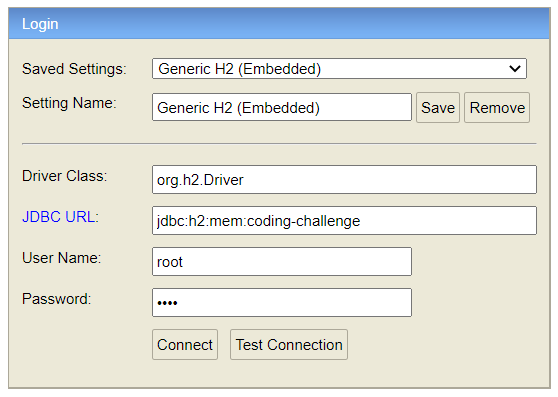

# Coding-Challenge-API
Small API that manages bank account statements storage and bank account balance calculations. 

## Getting started
- Navigate to project folder
- Run `maven install`, it will create `coding-challenge-app.jar` in `/target` folder
- Run `docker build -t coding-challenge-app .`
- Run `docker run -d -t --name <any-name> -p 9090:9090 coding-challenge-app`
- Try sending request to endpoints

To connect to h2 database, go to `http://localhost:9090/h2-console`, `Password`:`root`

## Endpoints

Base URL `http://localhost:9090/v1/bank-accounts-statements`

### GET retrieves bank account statements in _optional_ time range (Download CSV)
Example `http://localhost:9090/v1/bank-accounts-statements/csv?from=<date>&to=<date>`

### POST one or many bank account statements (Upload CSV)
Example `http://localhost:9090/v1/bank-accounts-statements/csv`

### GET calculate balance of selected bank account in _optional_ time range 
Example `http://localhost:9090/v1/bank-accounts-statements/account/<account-number>/balance?from=<date>&to=<date>`

